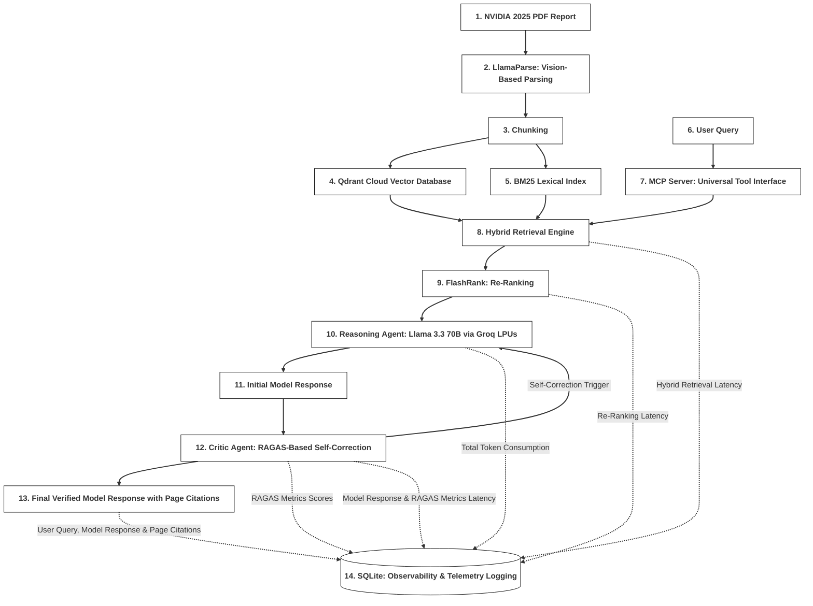

# AI-powered Agentic RAG Auditor: Hybrid Retrieval & MCP Systems Architecture 🔎
Built an Agentic Hybrid RAG system engineered for high-fidelity auditing of complex financial reports (e.g., NVIDIA Corporation Annual Review 2025). The architecture features a LangGraph-powered self-correction loop to eliminate hallucinations and an MCP-standardized interface for integration with external AI agents and orchestrators. By integrating Hybrid Retrieval (Qdrant Cloud Vector Database + BM25) with autonomous RAGAS evaluation, the system delivers verifiable, audit-ready insights through a production-grade, interoperable framework.

🚀 Live Demonstration: https://huggingface.co/spaces/Alexandre2001/nvidia-ai-auditor-2025

🎥 Video Demonstration: https://drive.google.com/file/d/1QUMNUFK7mNn_nR8Y164274tg1G5tCzVi/view?usp=sharing


    User query to the AI Agentic Hybrid RAG Auditor, model response and consulted pages.


    RAGAS evaluation metrics, agentic self-correction attempts and per-phase latency telemetry.


    Observability & Telemetry Dashboard.


### 🏗️ System Architecture:




### 💡 System Highlights:

- Designed and deployed a production-ready Hybrid RAG system for financial audit use-cases, engineered to be scalable to industrial documentation and complex technical reports.
- Architected a LangGraph-powered self-correction loop (ReAct) with autonomous reasoning and evaluation gating to identify and eliminate hallucinations.
- Built a Hybrid Retrieval Engine (Qdrant Cloud Vector Database + BM25) with FlashRank re-ranking to improve precision and page-level citation accuracy.
- Implemented RAGAS framework for performance quantification and SQLite telemetry for session management and interaction logging.
- Engineered modular data ingestion and an advanced OCR pipeline using LlamaParse for vision-based ingestion, structuring complex nested tables from PDFs into RAG-ready markdown.
- Designed and standardized an MCP Server to expose the RAG engine as a RESTful API toolset, decoupling retrieval logic from the interface and enabling integration with external LLM clients and orchestrators.
- Orchestrated low-latency LLM inference (Llama 3.3 on Groq LPUs) and deployed a production-ready Docker application.


### 📦 Quick Start:
- Clone & Navigate: Clone the repository and enter the project root.
- Install Dependencies: `pip install -r requirements.txt`
- Configure Credentials: Set `GROQ_API_KEY`, `LLAMA_CLOUD_API_KEY`, `QDRANT_API_KEY` and `QDRANT_URL` in a `.env` file.
- Ingest Documents: Run `python document_ingestion_pipeline.py` to populate the Qdrant Cloud Vector Database.
- Web Interface: Launch the dashboard using `streamlit run app.py`.
- MCP Server: Launch the toolset using `python mcp_server.py`.
- Docker Deployment: Build and run the containerized application:
  ```bash
  docker build -t ai-auditor .
  docker run -p 8501:8501 --env-file .env ai-auditor
  ```


### 📩 Contacts:
- Name: Alexandre Vasconcelos
- LinkedIn: https://www.linkedin.com/in/alexandre-vasconcelos-396227167/
- Email: alex.vasconcelos.2057@gmail.com
